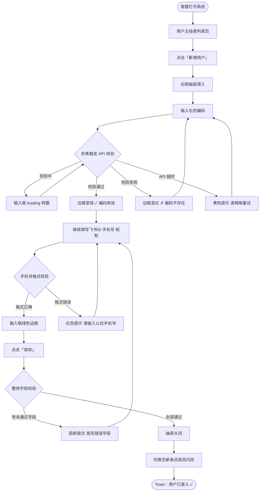
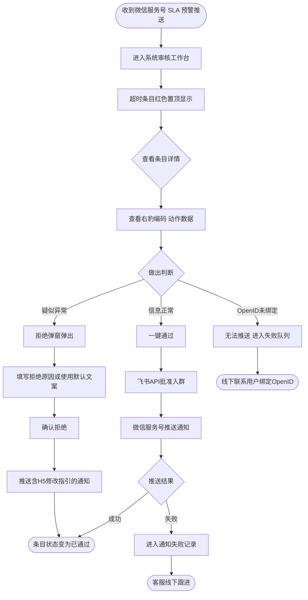
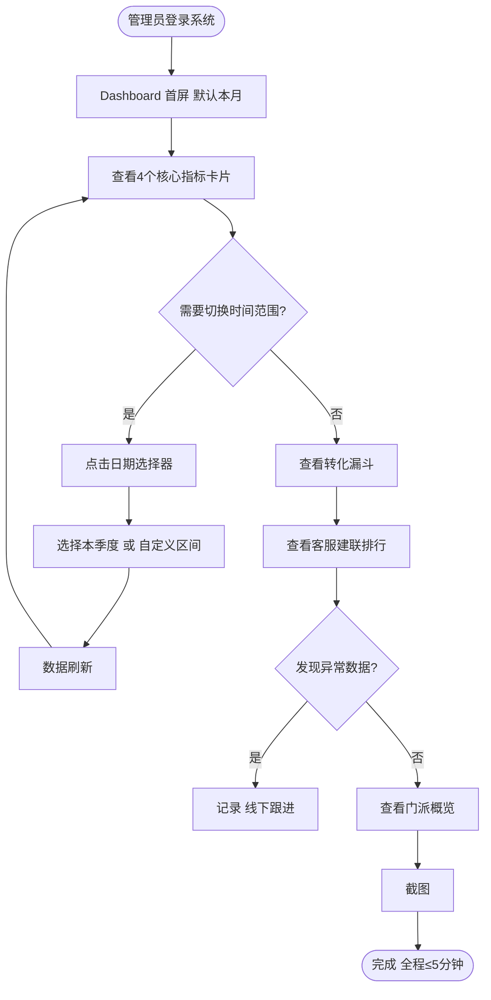

# UX 设计规范 · 客户服务中心

**作者：** Maziluo
**日期：** 2026-04-02

---

## 执行摘要

### 项目愿景

客户服务中心是右豹平台内部运营管理后台，将当前碎片化的「企业微信 + 飞书 + Excel」三工具组合整合为统一的数字化操作中心。系统核心目标是让客服团队能够在单一系统内完成从用户录入、入群审核到数据汇报的全部工作流，同时为管理层提供实时运营可见性。

**视觉设计方向（用户确认）：** 整体色调统一、简约大气、玻璃拟态（Glassmorphism）风格。

### 目标用户

| 角色 | 核心诉求 | 技术水平 |
|---|---|---|
| 普通客服 / 专属顾问 | 快速录入用户、追踪审核进度、减少工具切换 | 中等，熟悉 Excel 和飞书 |
| 审核员（叠加属性） | 及时感知 SLA 超时风险、快速审批或拒绝入群申请 | 中等 |
| 系统管理员 / 运营负责人 | 实时看板、全局数据可见性、团队绩效监控、权限管控 | 较高，习惯管理类工具 |

### 关键设计挑战

1. **多角色差异化视图：** 同一系统对不同角色呈现截然不同的功能范围和数据范围，需在统一设计语言下实现精准的权限视图隔离。
2. **强表单 + 实时校验的操作效率：** 用户录入包含多字段和实时API校验（≤2秒），需设计让客服感受到系统智能辅助而非等待负担。
3. **状态复杂的审核工作台：** 多状态标记（超时红/未超时橙/已处理）+ 列表页直接操作，需在信息密度和操作便捷性之间取得平衡。
4. **降级状态下的用户感知：** 4路外部API任一不可用时，需清晰传达降级状态而不引发恐慌。

### 设计机会

1. **SLA 预警视觉化：** 将时间压力转化为帮助审核员做优先级决策的视觉语言（红/橙色梯度 + 剩余时间展示）。
2. **Dashboard 汇报级设计：** 截图即可用于管理层汇报，数据密度高但视觉整洁，玻璃拟态风格可强化数字感。
3. **操作确认与审计追踪：** 通过合理的确认机制和操作日志可查性，建立用户对内部工具的信任感。

## 核心用户体验

### 定义性体验

客户服务中心的定义性体验是「录入新用户 → 等待入群申请 → 审核通过 → 推送通知」这条主链路的全程流畅感。最关键的单一动作是**右豹编码实时校验的反馈体验**——这是整个流程的起点，也是替代 Excel 最直接的价值体现点。

### 平台策略

- **平台：** 纯 Web 端管理后台，PC 浏览器为主
- **交互模式：** 鼠标 + 键盘，大量表单操作和列表批量操作
- **使用场景：** 工作日 08:00-22:00 联网使用，无离线需求
- **屏幕尺寸：** 以 1440px 宽度桌面端为基准设计

### 零思考交互

以下操作应无需思考即可完成：

- 编码校验结果感知（绿色通过 / 红色失败，即时视觉反馈）
- 列表页一键审核通过（无需跳转详情页）
- SLA 超时条目识别（红色高亮，扫一眼即知哪条紧急）
- Dashboard 关键数字读取（数据布局固定，每次打开位置一致）

### 关键成功时刻

| 时刻 | 用户感受 | 场景 |
|---|---|---|
| 编码校验绿色通过 | "系统帮我确认了，不会再出错" | 客服首次录入用户 |
| 审核工作台一键通过 | "比飞书群快多了" | 审核员日常操作 |
| Dashboard 5分钟准备好汇报数据 | "再也不用手动整理Excel了" | 管理员首次使用 |
| 飞书宕机时系统提示降级可继续 | "系统有备案，我知道该怎么做" | 异常降级场景 |

### 体验原则

1. **操作在当前页完成** — 高频操作（审核、状态确认、简单修改）尽量不跳转页面
2. **数据状态永远可见** — 用户随时知道一条记录的当前状态，无需点进详情才能判断
3. **错误预防优于错误修复** — 实时校验优先于提交后报错，确认弹窗优于误删恢复
4. **角色感知的界面** — 每个角色打开系统看到的是"为我准备的"内容，不被无关功能干扰

## 期望情感响应

### 核心情感目标

**主要情感目标：可靠感 + 掌控感 + 效率感**

> 用户打开系统时感受到："一切都在我掌控之中"

这是一个内部效率工具，不追求"惊喜感"，而追求沉稳的专业感——让用户在重复性的日常工作中感到顺手、放心、有成就感。

### 情感旅程地图

| 阶段 | 期望情感 | 避免的情感 |
|---|---|---|
| 首次登录看到角色专属视图 | 被照顾感、"这是为我设计的" | 信息过载、迷失感 |
| 录入用户时编码校验通过 | 被辅助感、放心、效率感 | 等待焦虑、不确定感 |
| 完成一批审核操作后 | 成就感、"今天的任务清零了" | 疲惫感、重复性厌倦 |
| 遇到API降级时看到提示 | 了然感、"我知道情况，我有方案" | 恐慌感、不知所措 |
| 管理员打开Dashboard汇报 | 自信感、专业感 | 数据难读、需要解释 |

### 关键微情感

- **信任 vs 怀疑：** 每次校验反馈、每次操作成功的提示，持续积累用户对系统的信任。玻璃拟态风格的精致视觉本身也是信任感的非语言来源。
- **掌控 vs 焦虑：** SLA 倒计时颜色梯度（橙→红）传递紧迫感，但整体克制的布局和留白让用户不感到被"压迫"。
- **效率 vs 疲惫：** 短操作路径、减少页面跳转，让重复性工作产生"顺手"而非"机械"的感受。

### 情感-设计连接

| 情感目标 | UX 设计策略 |
|---|---|
| 可靠感 | 操作结果明确反馈（成功/失败），不静默失败；降级状态显式标注 |
| 掌控感 | 状态可见性高，重要操作有二次确认，删除前展示影响范围 |
| 效率感 | 列表页直接操作，表单智能辅助，支持批量操作 |
| 专业感（管理员） | Dashboard 数据密度适当，视觉层次清晰，玻璃拟态卡片强化质感 |
| 被照顾感（客服） | 角色专属视图，个人数据优先展示，无关功能不出现在视野内 |

### 情感设计原则

1. **沉默是失败** — 每个用户操作必须有明确的系统反馈，绝不静默
2. **紧迫感有梯度** — 用颜色和视觉权重传达优先级，而非弹窗打断流程
3. **精致感即信任感** — 玻璃拟态的视觉质感是"这个系统靠谱"的非语言表达

## UX 模式分析与灵感来源

### 灵感产品分析

| 产品 | 借鉴价值 | 对应本项目的应用点 |
|---|---|---|
| **Linear** | 状态列表极简高效，列表页直接操作无需跳转；状态颜色编码清晰 | 审核工作台的列表页操作模式、红/橙状态标记体系 |
| **飞书多维表格** | 多字段表单渐进填写，用户熟悉度高 | 用户录入表单的字段布局和填写体验 |
| **Vercel / Railway 控制台** | 玻璃拟态现代管理后台的标杆，深色背景+半透明卡片+光泽感；API状态指示器设计精良 | 整体视觉风格、降级状态指示器设计 |
| **Grafana / DataDog** | 数据密度高但视觉有序的看板，时间范围选择器成熟，截图友好 | Dashboard 布局策略、日期筛选器、转化漏斗展示 |

### 可迁移的 UX 模式

**导航模式：**
- 左侧固定导航栏 + 内容区（管理后台标准范式，学习成本最低）
- 角色登录后菜单项按权限自动裁剪，无需用户感知权限边界

**交互模式：**
- 列表页行内操作（审核通过/拒绝按钮直接暴露，无需进入详情）
- 侧边抽屉详情（需要查看完整信息时从右侧滑出，不离开当前列表上下文）
- Toast 操作反馈（每次操作后轻量提示，不打断流程）
- 二次确认弹窗（仅高风险操作触发，如删除含关联数据的记录）

**视觉模式：**
- 玻璃拟态卡片（半透明背景 + backdrop-blur + 微边框光泽）用于 Dashboard 数据卡片
- 深色/中性底色背景，避免纯白管理后台的廉价感
- 状态徽标（Badge）颜色语义化：红=超时、橙=待处理、绿=已完成、灰=已归档

### 需要避免的反模式

- **全页面跳转处理高频操作** — 审核通过/拒绝不应跳转到独立页面
- **弹窗过度使用** — 仅高风险操作需要确认弹窗，状态变更类操作用 Toast 即可
- **表单字段平铺无分组** — 用户录入字段多（7+个），需按信息类型分组展示
- **降级状态静默处理** — API 不可用时必须有明显但非侵入性的页面级提示
- **数据看板无时间语境** — 所有数字需标注统计口径和时间范围，避免歧义

### 设计灵感策略

**直接采用：**
- Linear 的列表页行内操作模式 → 审核工作台
- Vercel 控制台的状态指示器设计 → API 降级状态展示
- Grafana 的日期范围选择器 → Dashboard 筛选器

**改良适配：**
- 飞书多维表格的表单体验 → 简化为单列布局 + 分组，减少飞书本身的复杂度
- DataDog 的数据卡片密度 → 降低密度，配合玻璃拟态风格增加留白

**刻意回避：**
- 通用 ERP/CRM 风格（如 Salesforce）的密集表格和多层标签页设计
- 纯白背景 + 蓝色主色调的标准管理后台视觉

## 设计系统基础

### 设计系统选型

**选定方案：Naive UI + Tailwind CSS**

### 选型理由

1. **Naive UI** 是专为 Vue3 设计的组件库，主题系统基于 CSS 变量，支持深度定制颜色、圆角、阴影、透明度——实现玻璃拟态的必要基础
2. **Tailwind CSS** 负责布局和自定义视觉层，`backdrop-blur`、`bg-opacity`、`shadow` 等玻璃拟态核心属性均为 Tailwind 原生 utility，无需额外 CSS 工具链
3. Naive UI 提供管理后台全套必需组件（DataTable、Form、Modal、Select、DatePicker、Tree 等），完整覆盖本项目 FR1-FR48 的 UI 需求
4. 1 名前端工程师可快速上手，组件文档完善，社区活跃

### 实施方案

- **组件层：** Naive UI 提供基础组件（表格、表单、弹窗、下拉、日期选择器等）
- **样式层：** Tailwind CSS 处理布局、间距、玻璃拟态视觉效果
- **主题配置：** 通过 Naive UI 的 `themeOverrides` 统一定义主色调、圆角半径、边框颜色，确保全局视觉一致
- **自定义组件：** Dashboard 数据卡片、SLA 状态标签、API 状态指示器等业务专属组件基于 Naive UI 基础组件扩展

### 定制策略

- **玻璃拟态卡片：** `bg-white/10 backdrop-blur-md border border-white/20 shadow-xl` 为基础样式，叠加 Naive UI 的 Card 组件结构
- **主色调：** 使用中性深色（slate-900 / slate-800）作为主背景，配合蓝紫色系（indigo / violet）作为强调色，避免廉价感
- **状态色语义：** 红（#ef4444）= 超时/错误，橙（#f97316）= 待处理/警告，绿（#22c55e）= 成功/通过，灰（#6b7280）= 已归档/禁用

## 视觉设计基础

### 色彩系统

**整体色调：深色玻璃拟态（用户确认）**

| 层级 | 色值 | 用途 |
|---|---|---|
| 主背景 | `#0f172a` (slate-950) | 页面底色，深夜蓝黑 |
| 次背景 | `#1e293b` (slate-800) | 侧边栏、卡片底层 |
| 强调色 | `#6366f1` (indigo-500) | 主操作按钮、活跃状态、选中高亮 |
| 强调浅色 | `#818cf8` (indigo-400) | hover 状态、次级强调 |
| 玻璃层 | `rgba(255,255,255,0.08)` | 卡片背景，配合 `backdrop-blur-xl` |
| 玻璃边框 | `rgba(255,255,255,0.12)` | 卡片边框光泽线 |
| 成功绿 | `#22c55e` | 审核通过 / 编码有效 |
| 警告橙 | `#f97316` | SLA 待处理（橙色高亮） |
| 危险红 | `#ef4444` | SLA 超时（红色高亮） |
| 禁用灰 | `#475569` | 已归档 / 不可操作 |
| 信息蓝 | `#38bdf8` | 系统提示 / API 降级状态 |

### 排版系统

| 用途 | 字体 | 字号 | 字重 |
|---|---|---|---|
| 页面标题 | Inter / PingFang SC | 24px | 700 |
| 模块标题 | Inter / PingFang SC | 18px | 600 |
| 卡片标题 | Inter / PingFang SC | 16px | 600 |
| 正文内容 | Inter / PingFang SC | 14px | 400 |
| 辅助说明 | Inter / PingFang SC | 12px | 400 |
| 数据大字（Dashboard 核心指标） | Inter | 32px | 700 |
| 编码/等宽字段 | JetBrains Mono | 14px | 400 |

### 间距与布局基础

- **基础单位：** 4px，常用间距：8 / 12 / 16 / 24 / 32 / 48px
- **圆角规范：** 卡片 12px，按钮 8px，状态标签 6px，输入框 8px
- **布局结构：** 左侧导航栏 240px 固定 + 内容区自适应（最大宽度 1200px）
- **页面内边距：** 24px；卡片间距：16px

### 无障碍合规

- 正文在深色背景上对比度 ≥ 4.5:1（WCAG AA）
- 所有交互元素保留可见焦点环（`ring-2 ring-indigo-500`）
- 状态标识不仅依赖颜色，同时附有文字标签和图标（色觉障碍友好）

## 核心体验机制

### 定义性体验

> **"录入用户编码，系统即时告诉你这个人是真实的"**

这是整个系统价值最浓缩的瞬间：客服输入右豹编码，≤2秒内获得明确反馈。这个时刻替代了 Excel 时代手动核对、事后发现填错的全部痛苦，是用户感知系统价值的第一个触点。

### 用户心智模型

**旧模式（Excel）：** 用户自行填入编码 → 不确定是否正确 → 不管继续 → 事后发现错误 → 溯源困难

**新模式（本系统）：**
- 心理转变：「我负责填准确」→「系统辅助我填准确」
- 错误拦截时机：从「事后发现」→「实时阻断」

### 成功标准

| 标准 | 指标 |
|---|---|
| 校验响应速度 | ≤2秒，不产生等待感 |
| 视觉反馈无歧义 | 绿色✓/红色✗，无需阅读文字即可判断 |
| 失败时给出行动指引 | 具体说明原因 + 建议操作，非通用"错误"提示 |
| 完整录入流程 | 新建到保存 ≤3分钟 |

### 体验机制设计（核心录入流程）

**1. 触发：** 点击「新增用户」→ 侧边抽屉从右侧滑入，不离开列表页

**2. 编码录入与校验：**
- 输入右豹编码 → 失焦后自动触发 API 校验
- 校验中：输入框右侧转圈 loading
- 通过：边框变绿 + ✓ 图标 + "编码有效"
- 失败：边框变红 + ✗ 图标 + 具体错误说明
- 超时：黄色提示 "校验服务响应慢，请稍候重试"

**3. 后续字段填写：** 手机号等字段输入时实时格式验证，即时反馈

**4. 提交与完成：**
- 未通过校验的字段阻断提交
- 保存成功 → 抽屉关闭 + 列表页新条目高亮 + Toast "用户已录入"

### 模式评估

- **沿用既有模式（零学习成本）：** 侧边抽屉表单、实时字段校验、Toast 反馈
- **本系统创新点：** 编码与外部 API 实时联动校验——这是 Excel 完全无法实现的，是用户「这比以前好多了」的关键体验差异

## 设计方向决策

### 已探索方向

| 方向 | 核心定位 | 主要特点 |
|---|---|---|
| **方向一** | 数据驱动 · Dashboard 优先 | 运营看板为核心入口，转化漏斗可视化，管理员视角 |
| 方向二 | 工作流中心 · 审核台优先 | 入群审核工作台为主界面，SLA 状态驱动操作 |
| 方向三 | 极简操作台 · 录入流程优先 | 图标细侧边栏，侧边抽屉录入，客服视角 |

### 选定方向

**方向一：数据驱动 · Dashboard 优先**，并增加深色/浅色模式双主题支持。

### 设计决策理由

1. **管理层价值最先呈现：** Dashboard 作为首屏，管理员登录即看到运营全貌，对齐「上线首日核心交付物」要求
2. **数据驱动文化落地：** 将原本无法度量的人工操作转化为可视化指标，Dashboard 是这一价值的最直观载体
3. **双主题提升适配性：** 深色模式适合长时间操作的客服/审核员（减少视觉疲劳），浅色模式适合在明亮会议室汇报时截图投影

### 实施说明

- **视觉文件：** `ux-design-directions.html`（含可交互的深色/浅色切换、页面导航、指标卡片、转化漏斗）
- **深色主题：** `#0f172a` 深夜蓝黑底色 + 玻璃拟态卡片 + indigo 强调色
- **浅色主题：** `#eef2f9` 柔和蓝灰底色 + 高透明度磨砂卡片，保持同等玻璃拟态质感
- **Dashboard 布局：** 4 核心指标卡片 → 转化漏斗 + 客服排行 + 门派概览 → 待处理摘要 + API 状态

## 用户旅程流程

### 旅程一：普通客服接入新用户（主链路）

### 旅程二：审核员处理 SLA 超时（紧急操作）

### 旅程三：管理员 Dashboard 汇报准备

### 旅程可复用模式

| 模式 | 触发场景 | 实现方式 |
|---|---|---|
| **抽屉式表单** | 新增/编辑记录 | 右侧滑入，不离开列表页 |
| **列表页行内操作** | 高频审核通过/拒绝 | 操作按钮直接暴露在列表行 |
| **实时字段校验** | 编码、手机号录入 | 失焦触发，即时绿/红视觉反馈 |
| **Toast 结果反馈** | 所有写操作完成后 | 右上角轻量提示，3秒自动消失 |
| **状态颜色梯度** | SLA 超时标记 | 红=超时，橙=待处理，无需阅读文字即可判断 |

### 流程优化原则

1. **最短路径优先** — 审核通过从"看到条目"到"完成操作"不超过 2 次点击
2. **渐进式错误暴露** — 字段错误在填写时即时反馈，不等到提交时集中报错
3. **降级路径明确** — 每条 API 依赖的操作均有手动替代路径，流程图中均有标注

## 组件策略

### 设计系统原生组件（直接使用）

| 组件 | 用途 | 覆盖需求 |
|---|---|---|
| `NDataTable` | 用户主档表、审核工作台、日志列表 | FR4、FR14、FR47 |
| `NForm / NFormItem` | 用户录入、付费记录录入 | FR1、FR7 |
| `NDrawer` | 新增/编辑侧边抽屉 | FR1、FR5 |
| `NModal` | 拒绝原因弹窗、删除确认弹窗 | FR17、FR6 |
| `NSelect` | 所属客服/导师/门派下拉 | FR4 |
| `NDatePicker` | 付费时间、Dashboard 日期筛选 | FR10、FR41 |
| `NUpload` | 企微二维码上传、Excel 批量导入 | FR8、FR33 |
| `NTabs` | 模块内视图切换 | FR39 |
| `NMessage / NNotification` | 操作结果轻量反馈 | 全局 |
| `NTag / NBadge` | 状态标签（超时/待审/已通过） | FR14、FR25 |

### 自定义业务专属组件

**① `CodeVerifyInput` — 编码校验输入框**
- 基于 `NInput` 扩展：失焦自动触发 API 校验、三态视觉反馈
- 状态：`idle` / `validating`（loading 转圈）/ `valid`（绿边框 ✓）/ `invalid`（红边框 ✗）/ `timeout`（黄色重试提示）

**② `MetricCard` — 玻璃拟态指标卡片**
- Dashboard 专用，顶部光泽线 + backdrop-blur + hover 上浮效果
- 插槽：标题、主数字、趋势说明、右上角状态徽标

**③ `SlaStatusBadge` — SLA 状态徽标**
- 根据申请时间自动计算状态并渲染对应颜色
- 超时红（超时 N天）/ 临近橙（剩余 N小时）/ 正常灰

**④ `ApiStatusBar` — API 降级状态条**
- 页面顶部非侵入式横幅，正常时不显示
- 降级警告（蓝色信息条）/ 完全不可用（橙色警告条）+ 手动导入入口

**⑤ `ConversionFunnel` — 转化漏斗图**
- 水平渐进条形图，各阶段数值 + 转化率标注
- 支持日期范围 prop 联动刷新

### 实施优先级

| 阶段 | 组件 | 依赖场景 |
|---|---|---|
| 第一阶段（核心链路） | `CodeVerifyInput`、`SlaStatusBadge`、审核工作台 DataTable 配置、录入抽屉 | 用户录入、审核操作 |
| 第二阶段（管理层交付） | `MetricCard`、`ConversionFunnel`、`ApiStatusBar` | Dashboard、降级场景 |
| 第三阶段（体验完善） | 主题定制、深色/浅色切换、其余标准组件适配 | 全局一致性 |

## UX 一致性模式

### 按钮层级

| 层级 | 样式 | 使用规则 |
|---|---|---|
| **主操作** | 实心 indigo | 每页/每弹窗唯一一个（「保存」「通过」「确认」） |
| **次操作** | 描边半透明 | 辅助操作（「取消」「拒绝」「导出」） |
| **危险操作** | 实心红色 | 不可逆操作（「删除」），必须配合确认弹窗 |
| **文字链接** | 无边框纯色 | 低权重操作（「查看详情」「手动刷新」） |

> 规则：每个对话框/抽屉最多 1 个主按钮；审核列表行内「通过」按钮作为局部主操作例外。

### 反馈模式

| 场景 | 方式 | 持续 |
|---|---|---|
| 操作成功 | Toast 绿色轻提示（右上角） | 3秒自动消失 |
| 操作失败 | Toast 红色 + 重试按钮 | 手动关闭 |
| 字段校验失败 | 输入框红色边框 + 下方说明文字 | 实时，修正后消失 |
| 高风险操作 | Modal 确认弹窗，列出影响范围 | 等待用户确认 |
| 长时间操作 | 全局进度条 + 完成后 Toast 结果摘要 | 操作期间持续 |
| API 降级 | 页面顶部 `ApiStatusBar`（非弹窗） | 降级期间持续 |

### 表单模式

- **必填字段：** 标签右侧红色星号 `*`，提交时高亮未填字段
- **校验时机：** 失焦触发（不在输入中打断），提交时全量校验
- **错误说明：** 字段下方一行，说明原因 + 修正建议，不只说"错误"
- **分组策略：** 7+ 字段时按信息类型分组（基础信息 / 飞书信息），使用分割线区隔
- **等宽字段：** 右豹编码、飞书 ID 等标识类字段使用 `JetBrains Mono` 字体显示

### 列表/表格模式

- **默认排序：** 时间类列表倒序；审核工作台按 SLA 紧迫度排序（超时优先）
- **行内操作：** 高频操作直接暴露；低频操作收入「…」更多菜单
- **空状态：** 图标 + 说明 + 引导操作按钮（如「导入第一条记录」）
- **加载状态：** 骨架屏（非 loading 转圈），保持布局稳定
- **分页：** 默认每页 20 条，支持 50/100 切换

### 弹窗与抽屉模式

| 场景 | 使用抽屉 | 使用弹窗 |
|---|---|---|
| 新增/编辑记录 | ✅ 右侧滑入，不离开列表 | ❌ |
| 高风险确认（删除） | ❌ | ✅ 小型居中弹窗 |
| 拒绝原因填写 | ❌ | ✅ 含文本域 |
| 查看完整详情 | ✅ 右侧宽抽屉 | ❌ |

### 导航模式

- **活跃状态：** 当前菜单 indigo 背景高亮 + 左侧 2px 指示条
- **权限裁剪：** 无权限菜单项完全不渲染（非置灰），角色视图天然干净
- **面包屑：** 三级以上层级显示，二级以内不显示
- **页面标题：** 每页固定 H1 + 副标题（数据新鲜度/时间范围）

## 响应式设计与无障碍

### 响应式策略

本系统为**桌面端优先**，无移动端需求（PRD 明确排除）。

| 断点 | 宽度 | 布局策略 |
|---|---|---|
| **标准桌面**（设计基准） | ≥ 1280px | 240px 侧边栏 + 内容区，4列指标卡片，完整功能 |
| **窄桌面/笔记本** | 1024–1279px | 侧边栏收缩至 200px，指标卡片改为 2×2 布局 |
| **平板**（保障可用） | 768–1023px | 侧边栏折叠为图标模式，内容区单列，功能完整 |
| **移动端** | < 768px | 不支持（内部工具，使用场景明确为桌面办公） |

### 无障碍合规策略

**目标：WCAG 2.1 AA 级**

| 合规项 | 要求 | 实现方式 |
|---|---|---|
| 色彩对比度 | 正文 ≥ 4.5:1，大字 ≥ 3:1 | 深/浅色主题均需验证 |
| 键盘可导航 | 所有交互元素可 Tab 到达 | Naive UI 原生支持，自定义组件补充 |
| 焦点指示器 | 可见焦点环 | `ring-2 ring-indigo-500`，不依赖浏览器默认 |
| 状态非颜色依赖 | 色觉障碍友好 | 所有状态同时附文字标签 + 图标 |
| 触控目标 | ≥ 44×44px | 按钮最小高度 40px + 内边距保障 |
| 图片替代文本 | 所有图片有 alt | 企微二维码图片需补充 alt 描述 |

### 测试策略

- **浏览器：** Chrome（主）、Edge（备）、Safari（macOS 用户）
- **分辨率：** 1440×900 为设计基准，1920×1080 验证大屏效果
- **无障碍工具：** axe DevTools 自动扫描（集成 CI），手动 Tab 导航验证
- **主题测试：** 深色/浅色两套主题均验证对比度达标
